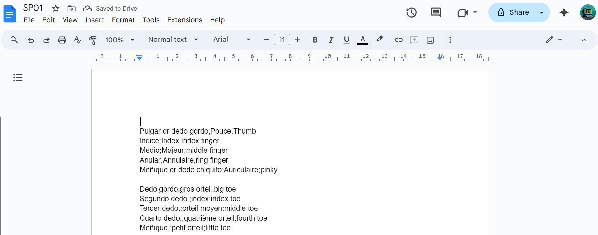
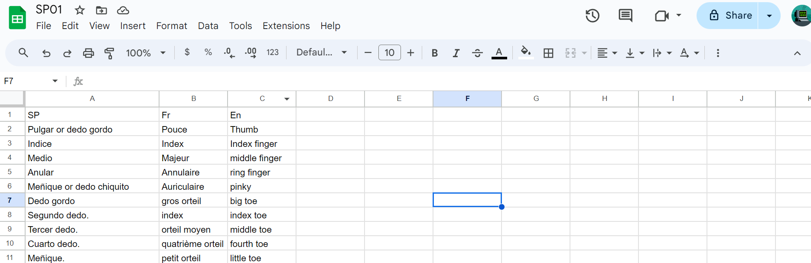

Google Docs to Google Sheets Converter
--------------------------------------
This Google Apps Script automates the process of converting structured text from a Google Docs document into a Google Sheets spreadsheet. The script reads the text from the Google Doc, parses it based on a specific delimiter, and creates a corresponding Google Sheets document.

## Input:

## Output:

## Usage
1. Copy the Script: Add the script to your Google Apps Script project.
2. Modify the Document ID: Replace the docId in the script with the ID of your Google Docs document.
2. Run the Script: Execute the script to generate the Google Sheets document with the parsed data.

## Contributing
If you find a bug or have an idea for improvement, feel free to open an issue or submit a pull request.